# Firestore ER Diagram (4NF)

> **Last Updated:** February 21, 2026
> 
> **Recent Changes:**
> - Messages now embedded in CONVERSATION document (reduces reads by 90%+)
> - Auto-cleanup: conversations older than 2 days are deleted
> - Usage logs retained indefinitely for analytics

```mermaid
erDiagram
    USER {
        string userId PK
        timestamp lastActive
        number interactionCount
    }

    AI_CONFIG {
        string userId PK, FK
        string model
        string context
        timestamp updatedAt
    }

    AI_CONFIG_FILE {
        string fileId PK
        string userId FK
        string sourceName
        string mimeType
        timestamp createdAt
        timestamp updatedAt
    }

    PROFILE {
        string userId PK, FK
        string businessName
        string businessType
        string contactEmail
        string contactPhone
        string description
        timestamp updatedAt
    }

    ONBOARDING {
        string userId PK, FK
        number currentStep
        boolean completed
        timestamp updatedAt
    }

    ONBOARDING_STEP {
        string onboardingStepId PK
        string userId FK
        number stepNo
        string status
        timestamp updatedAt
    }

    CONSULTANT_CONFIG {
        string userId PK, FK
        boolean enabled
        string bookingType
        number slotDuration
        number maxTokensPerDay
        boolean dynamicAllocation
        string timezone
        timestamp updatedAt
    }

    CONSULTANT_DAY_SCHEDULE {
        string scheduleId PK
        string userId FK
        string dayName
        boolean enabled
        string startTime
        string endTime
        string breakStart
        string breakEnd
    }

    CONVERSATION {
        string conversationId PK
        string odId FK
        string channel
        string participantKey
        array messages "embedded array"
        timestamp createdAt
        timestamp updatedAt
    }

    CONVERSATION_MESSAGE {
        string role "user or model"
        string content
        timestamp timestamp
    }

    USAGE_LOG {
        string usageId PK
        string userId FK
        number inputTokens
        number outputTokens
        timestamp createdAt
    }

    MESSAGE_QUEUE {
        string queueId PK
        string userId FK
        string remoteJid
        string payloadRef
        string payloadType
        string payloadText
        boolean processed
        timestamp queuedAt
        timestamp processedAt
    }

    BOOKING {
        string bookingId PK
        string userId FK
        string phone
        string name
        string reason
        string date
        string timeSlot
        number tokenNumber
        string status
        timestamp createdAt
        timestamp confirmedAt
        string confirmedBy
        string staffNote
        timestamp updatedAt
    }

    KNOWLEDGE_SOURCE {
        string sourceId PK
        string userId FK
        string source
        string category
        number chunks
        timestamp createdAt
        timestamp updatedAt
    }

    KNOWLEDGE_CHUNK {
        string chunkId PK
        string userId FK
        string sourceId FK
        string source
        string category
        number index
        string content
        vector embedding
        timestamp createdAt
        timestamp updatedAt
    }

    WHATSAPP_CRED {
        string keyId PK
        string userId FK
        string value
        timestamp updatedAt
    }

    USER ||--|| AI_CONFIG : has
    USER ||--|| PROFILE : has
    USER ||--|| ONBOARDING : has
    USER ||--|| CONSULTANT_CONFIG : has

    USER ||--o{ AI_CONFIG_FILE : has
    USER ||--o{ ONBOARDING_STEP : has
    USER ||--o{ CONSULTANT_DAY_SCHEDULE : has
    USER ||--o{ CONVERSATION : owns
    USER ||--o{ USAGE_LOG : logs
    USER ||--o{ MESSAGE_QUEUE : queues
    USER ||--o{ BOOKING : receives
    USER ||--o{ KNOWLEDGE_SOURCE : indexes
    USER ||--o{ KNOWLEDGE_CHUNK : stores
    USER ||--o{ WHATSAPP_CRED : stores

    CONVERSATION ||--|{ CONVERSATION_MESSAGE : "embeds (max 100)"
    KNOWLEDGE_SOURCE ||--o{ KNOWLEDGE_CHUNK : groups
```



---

## Data Flow Optimizations

### Conversation Storage (New Model)
Messages are now **embedded** within the conversation document instead of stored as separate documents:

```
users/{userId}/conversations/{conversationId}
├── channel: "whatsapp"
├── participantKey: "919876543210"
├── messages: [                    ← Embedded array (max 100)
│   { role: "user", content: "Hi", timestamp: ... },
│   { role: "model", content: "Hello!", timestamp: ... }
│ ]
├── createdAt: timestamp
└── updatedAt: timestamp
```

**Benefits:**
- 1 read per conversation instead of N reads (one per message)
- Atomic updates for user+model message pairs
- Reduced Firestore costs by 90%+

### Caching Layers

| Cache | TTL | Purpose |
|-------|-----|---------|
| AI Settings | 60s | Reduce settings reads |
| Consultant Settings | 2min | Reduce booking config reads |
| RAG Context | 5min | Cache vector search results |

### Auto-Cleanup Rules

| Data Type | Retention | Reason |
|-----------|-----------|--------|
| Conversations | 2 days | Keep context fresh, reduce storage |
| Usage Logs | Forever | Analytics & billing records |
| Bookings | Forever | Business records |

### Pre-built Responses
Common patterns bypass AI entirely:
- Greetings: `hi`, `hello`, `hey`, etc.
- Thanks: `thanks`, `thank you`, etc.
- Bye: `goodbye`, `bye`, `see ya`, etc.

**Saves:** AI API call + Firestore reads + RAG search
