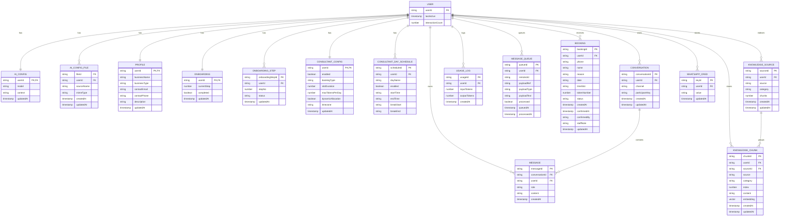

# Firestore ER Diagram (4NF)

```mermaid
erDiagram
    USER {
        string userId PK
        timestamp lastActive
        number interactionCount
    }

    AI_CONFIG {
        string userId PK, FK
        string model
        string context
        timestamp updatedAt
    }

    AI_CONFIG_FILE {
        string fileId PK
        string userId FK
        string sourceName
        string mimeType
        timestamp createdAt
        timestamp updatedAt
    }

    PROFILE {
        string userId PK, FK
        string businessName
        string businessType
        string contactEmail
        string contactPhone
        string description
        timestamp updatedAt
    }

    ONBOARDING {
        string userId PK, FK
        number currentStep
        boolean completed
        timestamp updatedAt
    }

    ONBOARDING_STEP {
        string onboardingStepId PK
        string userId FK
        number stepNo
        string status
        timestamp updatedAt
    }

    CONSULTANT_CONFIG {
        string userId PK, FK
        boolean enabled
        string bookingType
        number slotDuration
        number maxTokensPerDay
        boolean dynamicAllocation
        string timezone
        timestamp updatedAt
    }

    CONSULTANT_DAY_SCHEDULE {
        string scheduleId PK
        string userId FK
        string dayName
        boolean enabled
        string startTime
        string endTime
        string breakStart
        string breakEnd
    }

    CONVERSATION {
        string conversationId PK
        string userId FK
        string channel
        string participantKey
        timestamp createdAt
        timestamp updatedAt
    }

    MESSAGE {
        string messageId PK
        string conversationId FK
        string userId FK
        string role
        string content
        timestamp createdAt
    }

    USAGE_LOG {
        string usageId PK
        string userId FK
        number inputTokens
        number outputTokens
        timestamp createdAt
    }

    MESSAGE_QUEUE {
        string queueId PK
        string userId FK
        string remoteJid
        string payloadRef
        string payloadType
        string payloadText
        boolean processed
        timestamp queuedAt
        timestamp processedAt
    }

    BOOKING {
        string bookingId PK
        string userId FK
        string phone
        string name
        string reason
        string date
        string timeSlot
        number tokenNumber
        string status
        timestamp createdAt
        timestamp confirmedAt
        string confirmedBy
        string staffNote
        timestamp updatedAt
    }

    KNOWLEDGE_SOURCE {
        string sourceId PK
        string userId FK
        string source
        string category
        number chunks
        timestamp createdAt
        timestamp updatedAt
    }

    KNOWLEDGE_CHUNK {
        string chunkId PK
        string userId FK
        string sourceId FK
        string source
        string category
        number index
        string content
        vector embedding
        timestamp createdAt
        timestamp updatedAt
    }

    WHATSAPP_CRED {
        string keyId PK
        string userId FK
        string value
        timestamp updatedAt
    }

    USER ||--|| AI_CONFIG : has
    USER ||--|| PROFILE : has
    USER ||--|| ONBOARDING : has
    USER ||--|| CONSULTANT_CONFIG : has

    USER ||--o{ AI_CONFIG_FILE : has
    USER ||--o{ ONBOARDING_STEP : has
    USER ||--o{ CONSULTANT_DAY_SCHEDULE : has
    USER ||--o{ CONVERSATION : owns
    USER ||--o{ MESSAGE : owns
    USER ||--o{ USAGE_LOG : logs
    USER ||--o{ MESSAGE_QUEUE : queues
    USER ||--o{ BOOKING : receives
    USER ||--o{ KNOWLEDGE_SOURCE : indexes
    USER ||--o{ KNOWLEDGE_CHUNK : stores
    USER ||--o{ WHATSAPP_CRED : stores

    CONVERSATION ||--o{ MESSAGE : contains
    KNOWLEDGE_SOURCE ||--o{ KNOWLEDGE_CHUNK : groups
```
